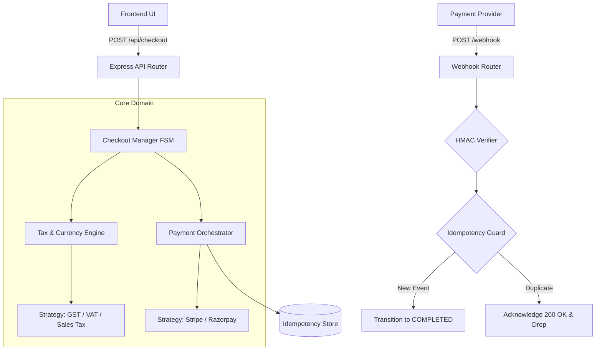

# 🚀 Globalized Checkout & Payment Orchestrator

A fault-tolerant, distributed Node.js checkout backend designed to handle asynchronous payment processing, global tax compliance, and dynamic gateway routing. 

This project demonstrates enterprise-level backend architecture, moving beyond basic CRUD operations to solve complex financial race conditions using **Finite State Machines (FSM)** and **Idempotency Keys**.

-----------------------------------------

## 🧠 System Architecture

This system is built using a decoupled, modular architecture. It leverages the **Strategy Design Pattern** to seamlessly switch between regional tax laws and payment gateways without mutating core business logic.

------------------------------------------------

## 🛠️ Engineering Highlights

1. Finite State Machine (FSM)

Checkout processes are incredibly fragile. A user might lose their internet connection or double-click a button. This system enforces a strict FSM (START ➔ ADDRESS_VALIDATED ➔ TAX_CALCULATED ➔ PAYMENT_PENDING ➔ COMPLETED).

Benefit: It guarantees deterministic state transitions. A checkout can never jump to COMPLETED without passing through the tax calculation phase.

2. Idempotency & Webhook Resilience

Financial networks are asynchronous and unreliable. Banks (Stripe/Razorpay) may delay webhooks or send them twice.

Implementation: The system utilizes a unique requestID to track the state of every transaction. If a provider sends a duplicate webhook, the Idempotency Guard intercepts it, acknowledges the provider with a 200 OK (so they stop retrying), but suppresses duplicate side-effects like sending multiple confirmation emails.

3. Strategy Pattern (Dynamic Gateway Routing)

Different payment gateways charge vastly different interchange fees based on the user's geography.

Implementation: The orchestrator inspects the buyer's countryCode and dynamically routes the transaction to the cheapest provider (e.g., Razorpay for India, Stripe for the US/EU). Adding a new country or gateway requires zero changes to the core checkout logic—adhering perfectly to the Open-Closed Principle.

-------------------------------------------------

## 📡 API Reference

POST /api/checkout

Initiates the checkout pipeline, calculates regional taxes, converts currencies, and routes to the optimal payment gateway.

Request Body:

{
  "cart": { "items": [{ "name": "Mechanical Keyboard", "priceUSD": 120, "qty": 1 }] },
  "userAddress": {
    "name": "Rohan Mehta",
    "email": "rohan@example.com",
    "countryCode": "IN"
  }
}

POST /webhook/payment-callback

The asynchronous endpoint for payment providers to confirm transactions. Protected by HMAC-SHA256 signature verification and strict idempotency checks.

Request Body:

{
  "checkoutID": "CHK-1772486961316-482E183E",
  "status": "Success",
  "transactionID": "rzp_mock_12345",
  "provider": "Razorpay"
}

-----------------------------------------------------

## 🚀 Getting Started (Local Development)

Prerequisites

Node.js (v18+ recommended)

Git

Installation

Clone the repository:

Bash
git clone [https://github.com/YOUR_USERNAME/globalized-checkout-orchestrator.git](https://github.com/YOUR_USERNAME/globalized-checkout-orchestrator.git)

Navigate into the directory and install dependencies:

Bash

cd globalized-checkout-orchestrator

npm install

Start the server:

Bash
node src/server.js

Open your browser and navigate to http://localhost:3005 to view the interactive checkout and terminal dashboard.

---------------------------------------------------------

Built to demonstrate scalable system design, distributed asynchronous logic, and product-focused engineering.

----------------------------------------------------
